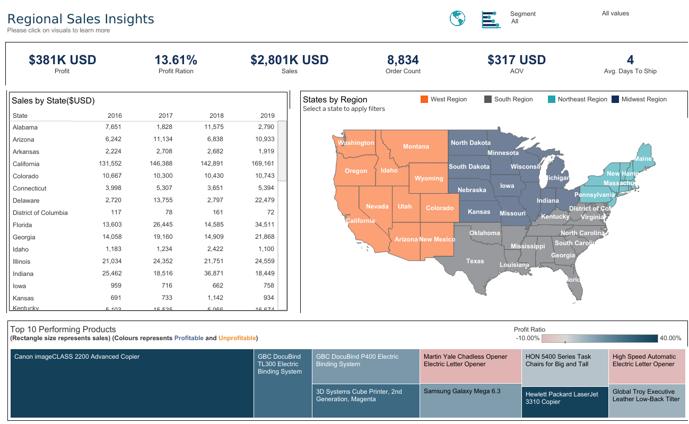
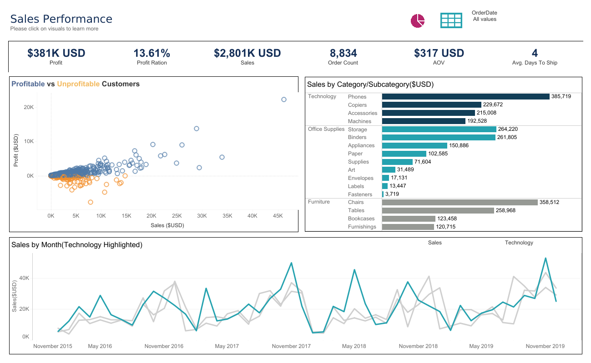
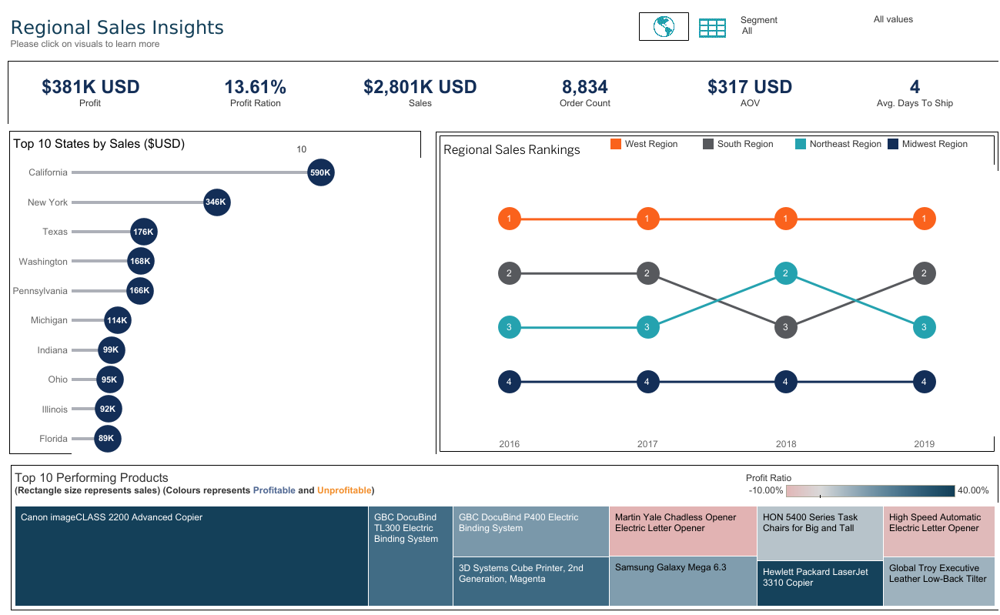

# 📊 Tableau Sales Analysis Dashboard


---

## 👀 What’s This Project About?

An interactive dashboard project built with **Tableau** to explore and visualize key sales metrics, customer behavior, and regional performance using historical sales data. This project provides a comprehensive overview of business performance through actionable insights and well-structured visualizations.

## 🌐 Live Dashboard

> ✅ [Sales Performance]([https://public.tableau.com/app/profile/sujit.singh5086/viz/TableauFundamentals_17483200559180/PerformancebyLocation](https://public.tableau.com/views/SalesPerformanceAnalysis_17625027305550/SalesOverviewDashboard?:language=en-US&:sid=&:redirect=auth&:display_count=n&:origin=viz_share_link))
> ✅ [Regional Sales Insights](https://public.tableau.com/views/SalesPerformanceAnalysis_17625027305550/PerformancebyLocationDashboard?:language=en-US&:sid=&:redirect=auth&:display_count=n&:origin=viz_share_link)  

---

## ❓ Key Business Questions & KPIs

This dashboard answers the following key performance questions:

- 🧮 **What are our topline metrics** such as total Sales, Orders, and Profit?
- 📦 **Which product categories and sub-categories** drive the most sales and profit?
- ⏳ **How has performance trended over time** across categories?
- 👥 **Who are our most and least profitable customers?**
- 🚚 **What are the most preferred shipping methods** by sub-category?
- 🌍 **Which regions and states** generate the highest sales and profit?
- 🏆 **What are our top-selling products?**
- 📍 **How does performance vary by state** in a detailed tabular format?
---

## 🛠 Tools & Technologies

- **Tableau Desktop** (Data visualization)
- **Excel / CSV** (Source data)

---

## 🗂️ Dataset Overview

This project includes two major components:
1. **SalesData workbook** with fact tables for order transactions  
2. **Dimension Tables workbook** with four lookup tables

---

## 📁 <a href="/Datasets/SalesData.xlsx">SalesData Workbook</a>

### Sheets
- **FactOrders** – Sales 2014-2017  
- **FactOrders18-19** –  Sales 2018–2019  

### Columns (both sheets)

| Column Name    | Data Type       | Description                                              |
|----------------|------------------|---------------------------------------------------------|
| `RowID`         | INT              | Unique row identifier                                  |
| `OrderID`       | VARCHAR/STRING   | Customer-facing order reference                        |
| `OrderDate`     | DATE             | Date the order was placed (YYYY-MM-DD)                 |
| `ShipDate`      | DATE             | Date the order was shipped (YYYY-MM-DD)                |
| `CustomerID`    | INT              | FK → `dimCustomer.CustomerID`                          |
| `ProductID`     | INT              | FK → `dimProduct.ProductID`                            |
| `PostalCodeID`  | INT              | FK → `dimLocation.PostalCodeID`                        |
| `ShipModeID`    | INT              | FK → `dimShipping.ShipModeID`                          |
| `Sales`         | DECIMAL(10,2)    | Sales revenue                                          |
| `Quantity`      | INT              | Number of units sold                                   |
| `Discount`      | DECIMAL(5,2)     | Discount as percentage (e.g., `0.20` = 20%)            |
| `Profit`        | DECIMAL(10,2)    | Profit amount                                          |

☑️ **Note:** Use **FactOrders** for current analytics; **FactOrders18-19** is for legacy trends.

---

## 🧩 <a href="/Datasets/Dimension%20Tables.xlsx">Dimension Tables Workbook</a>

### dimCustomer

| Column Name     | Data Type     | Description                                               |
|-----------------|----------------|----------------------------------------------------------|
| `CustomerID`     | INT (PK)       | Matches `FactOrders.CustomerID`                         |
| `CustomerName`      | VARCHAR        | Customer’s first name                                |


### dimLocation

| Column Name     | Data Type     | Description                                               |
|-----------------|----------------|----------------------------------------------------------|
| `Country`        | VARCHAR        | Country name                                            |
| `State`          | VARCHAR        | State/Province                                          |
| `Postal Ref`     | VARCHAR        | ZIP or postal code                                      |
| `Region`         | VARCHAR        | Region (e.g., West, East, Central)                      |
| `PostalCodeID`   | INT (PK)       | Matches `FactOrders.PostalCodeID`                       |

### dimProduct
ProductID	Segment	Category	SubCategory	ProductName

| Column Name      | Data Type     | Description                                              |
|------------------|---------------|----------------------------------------------------------|
| `ProductID`       | INT (PK)       | Matches `FactOrders.ProductID`                         |
| `Segment`         | VARCHAR        | Segment                                                |
| `Category`        | VARCHAR        | High-level category                                    |
| `SubCategory`     | VARCHAR        | More detailed category                                 |
| `ProductName`     | VARCHAR        | Full name/title of the product                         |

### dimShipping

| Column Name     | Data Type     | Description                                               |
|-----------------|----------------|----------------------------------------------------------|
| `ShipMode`       | VARCHAR        | Shipping method (e.g., Standard, First Class)           |
| `ShipModeID`     | INT (PK)       | Matches `FactOrders.ShipModeID`                         |

---

## 🔗 Relationships

- **FactOrders** and **FactOrders18-19** connect to dimensions via foreign keys:
  - `CustomerID` → `dimCustomer.CustomerID`
  - `ProductID` → `dimProduct.ProductID`
  - `PostalCodeID` → `dimLocation.PostalCodeID`
  - `ShipModeID` → `dimShipping.ShipModeID`

---

## ⚙️ Data Preparation Steps (in Tableau)

### 1. Import and Clean Fact Table
```
→ Imported 'FactOrders' into Tableau
→ Used Tableau's built-in Data Interpreter to:
   - Remove nulls
   - Fix headers
```

### 2. Extract Country from `OrderId`
Used Tableau's `SPLIT()` function to extract the country code from `OrderId`.

```tableau
SPLIT([OrderId], "-", 1)
```
### 3. Apply Aliases
Renamed country codes for clarity.

```text
CA → Canada  
US → United States
```

### 4. Import and Join Fact and Dimension Tables
Performed **Inner Joins** on ID fields:

```text
FactOrders.CustomerID     = Customers.CustomerID  
FactOrders.ProductID      = Products.ProductID  
FactOrders.PostalCodeID   = PostalCodes.PostalCodeID  
FactOrders.ShipModeID     = ShipModes.ShipModeID  
```
Renamed the resulting combined table to **SalesData**

### 5. Hide Unnecessary Columns from **Dimension Tables**
```text
→ Hidden columns:
   - CustomerID
   - ProductID
   - PostalCodeID
   - ShipModeID
```

### 6. Union Additional Records
Unioned the cleaned `SalesData` table with `FactOrders18-19`.

---

## 🔍 Dashboard Features





### 📌 Topline Summary
- Displays high-level KPIs including:
  - **Total Sales**
  - **Orders**
  - **Profit**
  - **Profit Ratio**

### 📦 Sales Analysis
- **Sales by Product Category and Sub-Category**
- **Top Selling Products** based on total revenue

### ⏱ Performance Over Time
- Time series trends:
  - Sales and profit **over time by Category**

### 👥 Customer Insights
- Identifies:
  - **Most Profitable Customers**
  - **Least Profitable Customers**

### 🚚 Shipping Preferences
- Breakdown of shipping methods by **Product Sub-Category**

### 🌍 Geographic Performance
- **Performance by Region** (Sales, Profit)
- **Top States by Sales**
- **Tabular view** showing performance **by State** (Sales, Profit, Quantity)

---

## 🔍 Key Insights

👥 Customer Insights:
  - **Leading Account:** Tamara Chand, with highest total sales and profit.
  - **Hunter Lopez**, **Raymond Buch**, and **Tom Ashbrook** — all delivering strong, profitable transactions.

🏆 Top-Selling Products Summary:
  - Phones lead in sales, driving the Technology category.
  - Chairs are top in Furniture, boosted by home office demand.
  - Binders show strong, steady sales in Office Supplies.
  - Storage products perform well across home and office needs.

💼 Popular Category:
  - **Technology and Office Supplies** are nearly equal in profit, with **Technology slightly ahead** overall.
  - By **end of 2019**, **Office Supplies overtook Technology** in profit — indicating a shift in demand and category strength.

🌍 Geographic Performance:
  - South region leads sales, followed closely by Northeast.
  - California leads with ~$590K in sales — dominant market with strong urban demand.
  - New York follows at ~$346K — strong metro-driven performance.
  - Texas, Washington & Pennsylvania show similar mid-tier sales.

🚚 Shipping Preferences:
  - **Standard Class** is the most preferred option, indicating customers prioritize cost-effective delivery over speed.
  - **Second Class** is also popular, offering a balance between faster shipping and moderate pricing.
  - **First Class** and **Same Day** are used less frequently, likely due to higher associated costs.
  - Overall, customers tend to prioritize affordability over speed, especially for non-urgent purchases.
    
---

## 👨‍💻 Author

**Sujit Singh**  
Data Analyst | EXCEL | Tableau | Power BI | SQL | Python  
📧 [sujit10x12@gmail.com]  
🌐 [https://www.linkedin.com/in/sujit10x12/]  

---

## ⚠️ License

This project is covered under a **Proprietary License (All Rights Reserved)**.  
For details, see the [LICENSE.txt](./LICENSE.txt) file.

© 2025 **Sujeet Singh** — This repository is for personal portfolio demonstration only.  
No reuse, redistribution, or modification is permitted.

---
